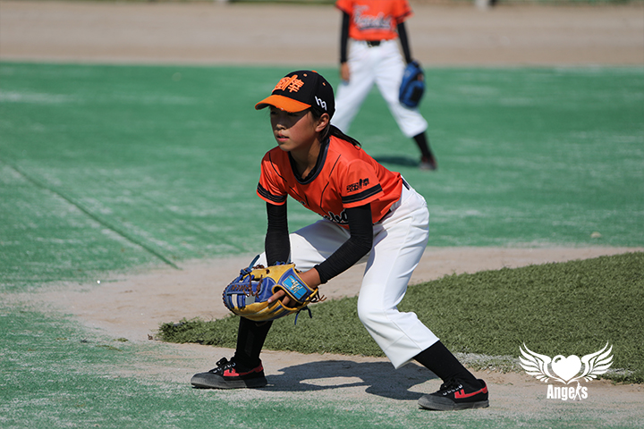

在我9岁的时候，也就是2019年12月，我加入了强棒基地，开始学习棒球。

虽然以前从未接触过棒球，但教练经常说我天生灵慧。我在2020年8月，就获得了第五届清华大学尹嘉瑞杯青少年棒球邀请赛冠军。不过我觉得，过往的辉煌不值得留恋，我更在意的是进一步发掘自己的潜力，迎接未来的光明。  

无论如何，我都觉得棒球改变了我的一生。如果没有棒球，今年11岁的我可能在不久后就会嫁人了，听起来是不是很难想象，因此我更加珍惜现在的一切。在强棒基地中，既有学习棒球的机会、也有学习文化课的窗口，我才能发挥出自身最大的热量。   

说不定有一天，我成为优秀的职业球员，也说不定会上大学读博士，甚至说不定我成为了教练继续育人。但无论哪一种未来，都令我无限憧憬。  

