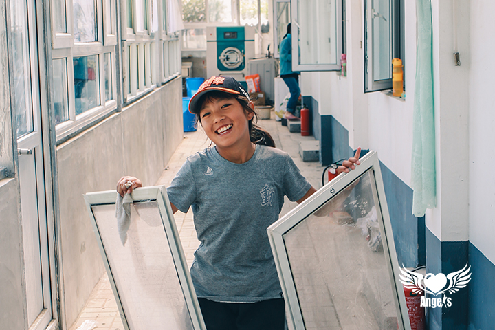
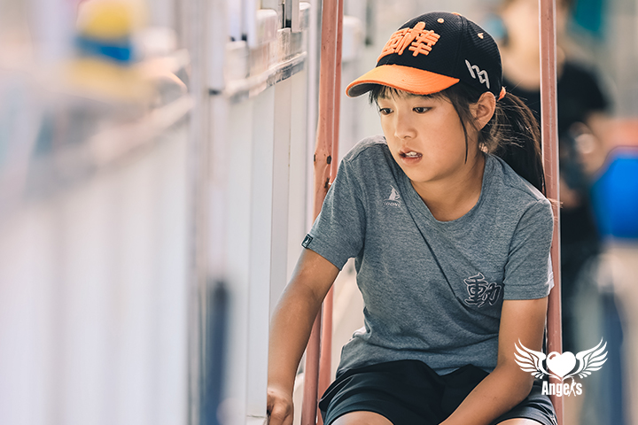

## 欢迎来到我的世界
hi~哥哥姐姐你好呀，很高兴认识你们♥

### 我的自我介绍
我是马海尔西，出生于2010年2月13日。我的老家在四川凉山州，我是彝族，所以有些黑的脸庞与雪白的牙齿形成鲜明对比😉当我调皮、机灵搞怪时，你看一眼我的眼眸就知道😀      

> 生命在于运动     
我喜欢跳皮筋，掌握了超多种跳法，甚至可以翻跃比自己还高的高度；同时，我还是玩沙包的一把好手，投掷和接包的准头都非常高；除此之外，基地为我们提供了丰富的课余生活选择，我还擅长双板滑雪🏂      

    

> 书籍是人类进步的阶梯        
当然啦，我学习起来可认真了，所以才成绩优异。我还喜欢读书与思考，我觉得思考是一件很重要的事，大家经常被我问住，最后都夸我思想有深度😛         

